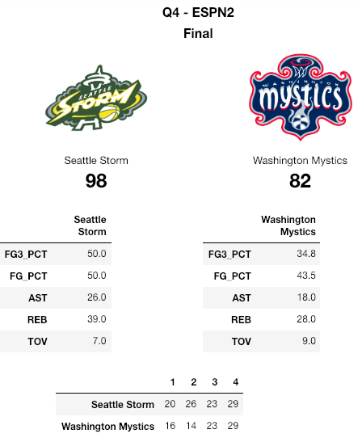
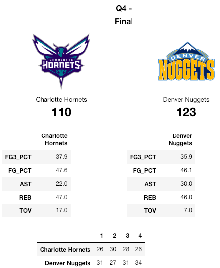

# scoreboard
Using Jupyter to build a dashboard displaying a basketball scoreboard 

## Description

This repo contains `scoreboard.ipynb` notebook that builds a prototype scoreboard display for WNBA and NBA games. The notebook uses the `ScoreBoard` (via the `scoreboardv2` endpoint of the [stats.nba.com](https://stats.nba.com)) and `Logo` classes of the `py_ball` package.

## Results

### WNBA

The scoreboard below shows the last game of the 2018 WNBA finals.

A quick glance at the scoreboard reveals that the Storm jumped out to an early lead and sustained it, likely due to an excellent shooting performance.

### NBA

The scoreboard below shows a regular season game from 1/5/2019.

The turnovers seemed to be an insurmountable issue for the Hornets on this night.
